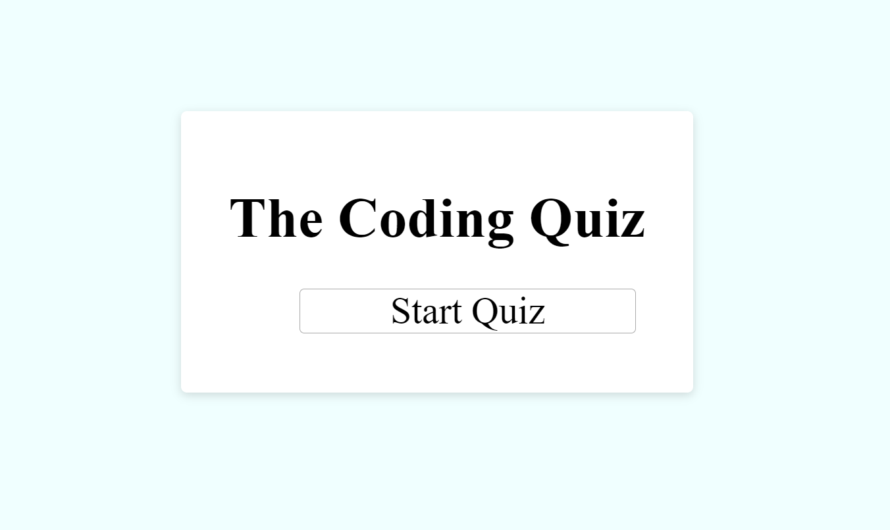
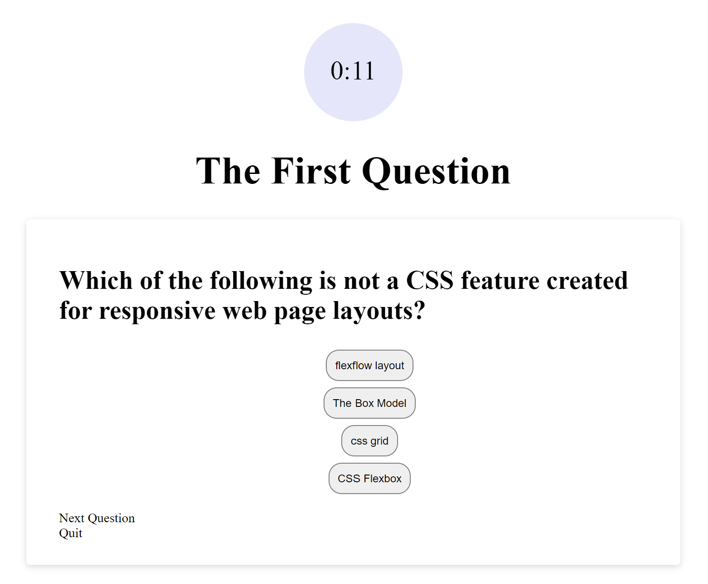
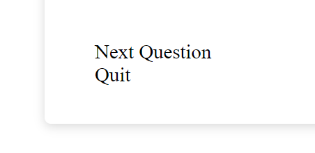

# Code Quiz
A quiz to test your knowledge of Javascript, HTML, and CSS

Take the quiz now: https://angeleefshaw.github.io/Javascript-HTML-CSS-Quiz/

# Description

This application allows users to test their understanding of basic HTML, CSS and Javascript concepts. Users are given 14 seconds to answer each question. 

# Demo

Each multiple choice question offers four possible answers. Select your answer to move to the next question. If you choose correctly, the answer will be colored green. If you choose incorrectly, the answer will be colored red.

After your selection, refer to the bottom left corner of the code card to move to the next question. If you wish to end the quiz, select the 'Quit' option. 

Your score will be displayed once you have completed the quiz. If you should quit before completing the quiz, your score will be calculated and displayed to you.  

# The Code

This application features HTML, CSS and Javascript 
